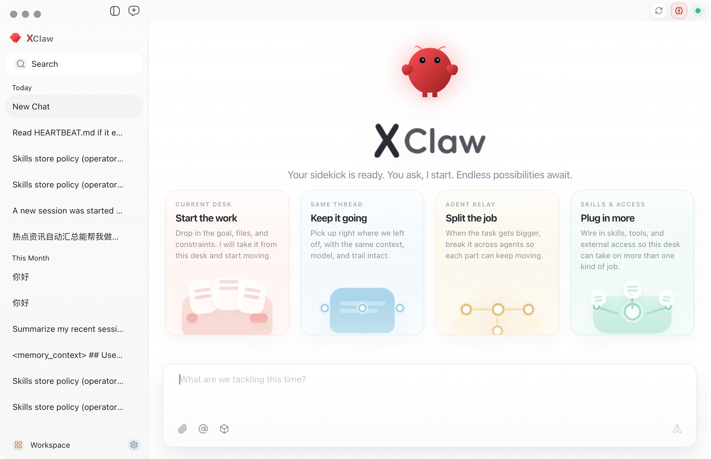
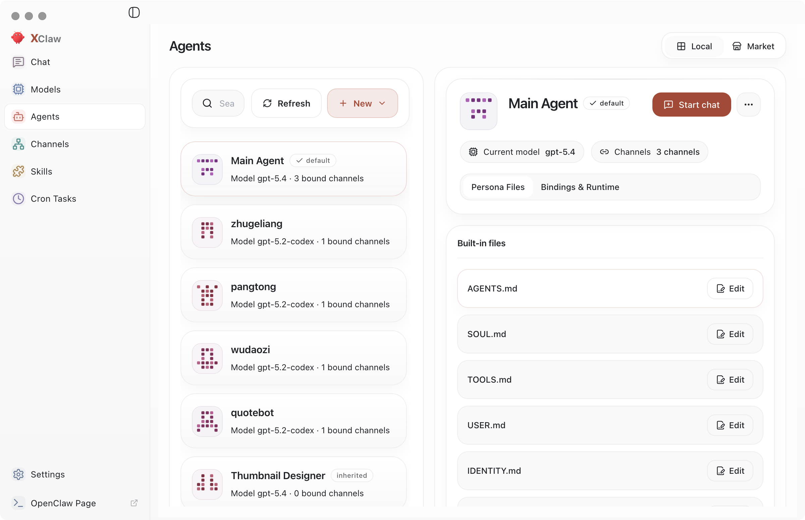
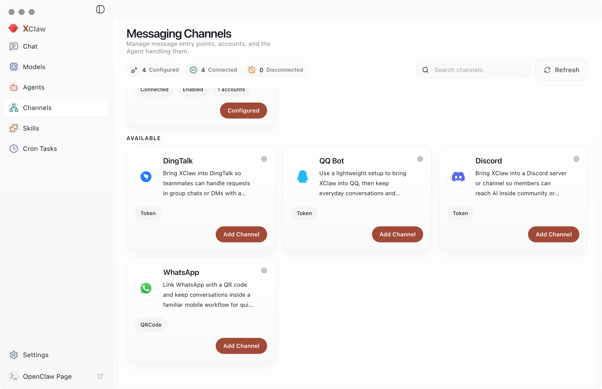
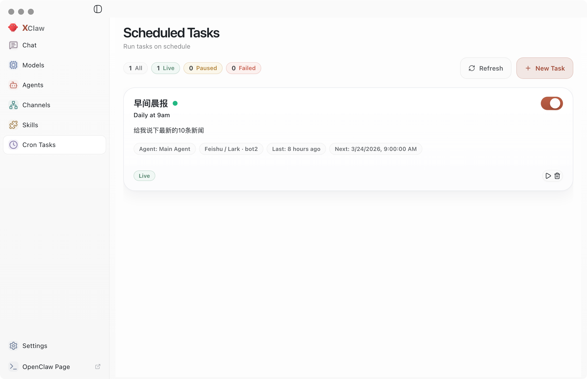
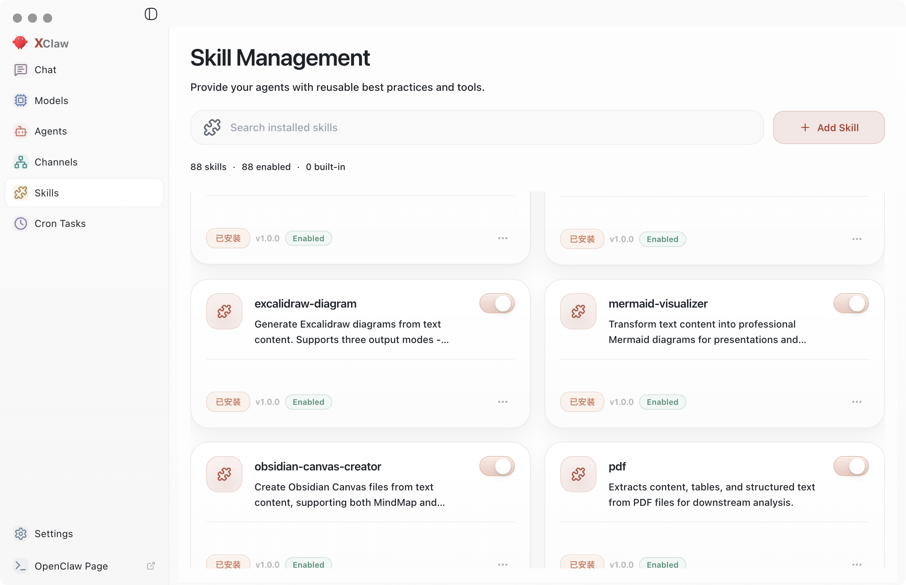
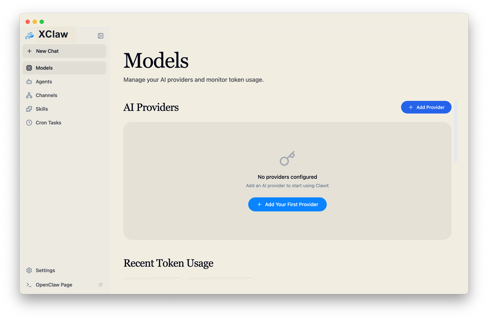
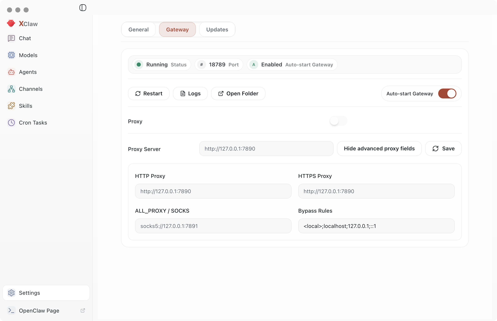

<p align="center">
  
</p>

<h1 align="center">XClaw</h1>

<p align="center">
  <strong>A Desktop App for OpenClaw AI Agents</strong>
</p>

<p align="center">
  <a href="#features">Features</a> •
  <a href="#why-xclaw">Why XClaw</a> •
  <a href="#getting-started">Getting Started</a> •
  <a href="#contributing">Contributing</a>
</p>

<p align="center">
  
  
  
  
  
</p>

<p align="center">
  English | <a href="README.zh-CN.md">简体中文</a>
</p>

---

## Overview

**XClaw** packages [OpenClaw](https://github.com/OpenClaw) into a desktop app for workflow automation, channel management, and scheduled agent tasks.

It ships with recommended model-provider presets, supports Windows and multiple languages, and keeps deeper controls under **Settings → Advanced → Developer Mode**.

---

## Screenshots

<p align="center">
  
  
</p>

<p align="center">
  
  
</p>

<p align="center">
  
  
</p>

<p align="center">
  
</p>

---

## Why XClaw

| Common Friction | What XClaw Does |
|-----------------|-----------------|
| CLI-heavy onboarding | Guided setup with one-click install |
| Manual config editing | Visual settings with live validation |
| Process babysitting | Gateway lifecycle handled automatically |
| Switching across providers | Adaptive provider cards with a token-intelligence workbench |
| Skill/plugin setup | Built-in marketplace and skill management |

---

## Features

### 🎯 Near-Zero Setup
Go from install to first AI message entirely in the GUI. No terminal commands, no YAML editing, and no hunting through environment variables.

### 💬 Agent-Centric Chat
The chat workspace supports multiple conversation contexts, history, Markdown rendering, and direct `@agent` routing from the main composer in multi-agent setups.

You can also switch the active model for the current session through OpenClaw's built-in per-session override flow, without changing your saved provider configuration.

The composer includes a local QClaw-style slash-command router and inline slash menu. `/new` and `/reset` are intercepted locally while still reusing the shared Gateway send path. `/model`, `/compact`, `/agents`, `/focus`, `/export`, and `/usage` stay renderer-side instead of being sent as normal chat turns. `/usage` shows the active session token summary inline, while `/focus` and `/export` remain desktop-side actions.

When you mention another agent with `@agent`, XClaw moves into that agent's own conversation context instead of relaying through the default agent. Workspaces remain isolated by default, and stronger runtime isolation still depends on OpenClaw sandbox settings.

### 🏢 Global Studio View
XClaw includes a read-only Studio view that is opened from the top-right office button. It runs a managed local Star Office runtime, shows the main agent plus local agents in one shared office, bridges local runtime events into live studio status updates, and keeps the chat workspace isolated from the embedded office scene.

### 📡 Multi-Channel Operations
Every channel can now hold multiple accounts, bind each account to a specific agent, and switch the default account directly from the Channels page.

XClaw also bundles the official WeChat channel plugin. That means WeChat accounts can be added or re-bound through GUI QR login without manually running `npx` or `openclaw`. The Channels workbench keeps the real WeChat account ID read-only, exposes QR re-login, and warns about session-expiry risk instead of sending automatic keep-alive traffic.

### ⏰ Scheduled Automation
Create AI jobs that run on a timer. Define the trigger, choose the interval, and let agents keep working without manual follow-up.

### 🧩 Expandable Skill Layer
XClaw also ships complete document-processing skills (`pdf`, `xlsx`, `docx`, `pptx`), deploys them to the managed skills directory on startup (default `~/.openclaw/skills`), and enables them automatically on first install. Additional bundled skills (`find-skills`, `self-improving-agent`, `tavily-search`, `brave-web-search`) are enabled by default as well. If required API keys are missing, OpenClaw reports the configuration errors at runtime.

The Skills page can list skills discovered from multiple OpenClaw locations, including the managed directory, the workspace, and extra skill directories. It also shows the real path for each skill so you can open the installed folder directly.

Environment variables used by bundled search skills:
- `BRAVE_SEARCH_API_KEY` for `brave-web-search`
- `TAVILY_API_KEY` for `tavily-search` (upstream skill runtime may also support OAuth)
- `find-skills` and `self-improving-agent` do not require API keys

### 🔐 Secure Provider Access
Connect providers such as OpenAI and Anthropic while keeping credentials in the operating system's native keychain. OpenAI supports both API keys and browser OAuth (Codex subscription) sign-in.

### 🌙 Theme That Adapts
Choose light mode, dark mode, or system sync. XClaw follows the preference automatically.

### 🚀 Launch on Login
In **Settings → General**, enable **Launch at system startup** if you want XClaw to open automatically after sign-in.

---

## Getting Started

### System Requirements

- **Operating System**: macOS 11+, Windows 10+, or Linux (Ubuntu 20.04+)
- **Memory**: 4 GB RAM minimum, 8 GB recommended
- **Storage**: 1 GB of free disk space

### Installation

#### Prebuilt Releases

Download the latest package for your platform from the [Releases](https://github.com/jlon/XClaw/releases) page.

#### Build from Source

```bash
# Clone the repository
git clone https://github.com/jlon/XClaw.git
cd XClaw

# Install dependencies and download uv
pnpm run init

# Start the desktop app in development mode
pnpm dev
```

On Linux, `pnpm dev` now handles two common headless-host failures automatically: it retries with Chokidar polling if the `inotify` watcher limit is exhausted, and if neither `DISPLAY` nor `WAYLAND_DISPLAY` is present it keeps Vite running but skips Electron startup. Set `XCLAW_FORCE_ELECTRON_DEV=1` if you have already prepared Xvfb, VNC, or another display server and still want Electron launched.

Windows packaging now trims non-target `node-llama-cpp` accelerator variants during `after-pack` and keeps only the CPU prebuilt for the target architecture. This cuts installer payload significantly without removing the CPU local-memory path.

### First Launch

On the first run, the **Setup Wizard** walks you through:

1. **Language & Region**: choose the preferred locale
2. **AI Provider**: add providers with API keys or OAuth when supported
3. **Skill Bundles**: pick preconfigured skills for common scenarios
4. **Verification**: confirm the setup before entering the main app

If your system language is supported, the wizard picks it by default. Otherwise, it falls back to English.

When the wizard needs to provision the core Python environment, the setup step now keeps the primary action in place, shows live install logs in a collapsible panel, and supports cancellation instead of only greying out the UI.

> Moonshot (Kimi) note: XClaw keeps Kimi web search enabled by default.
> When Moonshot is configured, XClaw also syncs Kimi web search in OpenClaw config to the China endpoint (`https://api.moonshot.cn/v1`).

---

## Contributing

### Contribution Flow

1. **Fork** the repository
2. **Create** a feature branch (`git checkout -b feature/amazing-feature`)
3. **Commit** your work with clear messages
4. **Push** the branch
5. **Open** a Pull Request

### Contribution Guidelines

- Follow the existing code style (`ESLint + Prettier`)
- Add tests for new behavior
- Update documentation when needed
- Keep commits focused and descriptive

---

## Community

<p align="center">
  
</p>

Partner inquiries: WeChat above or email [itjlon@gmail.com](mailto:itjlon@gmail.com).

---

## License

XClaw is distributed under the [MIT License](LICENSE). You are free to use, modify, and share the software.

---
