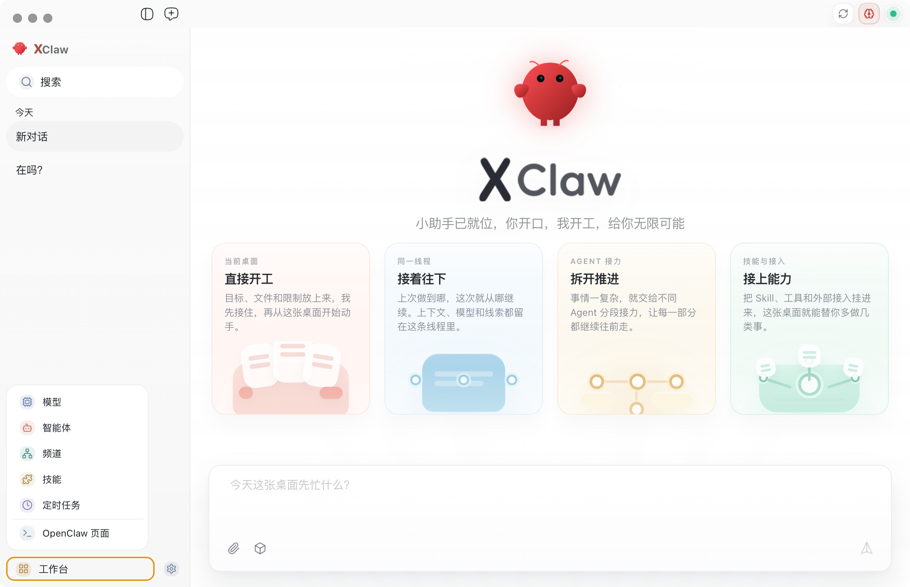
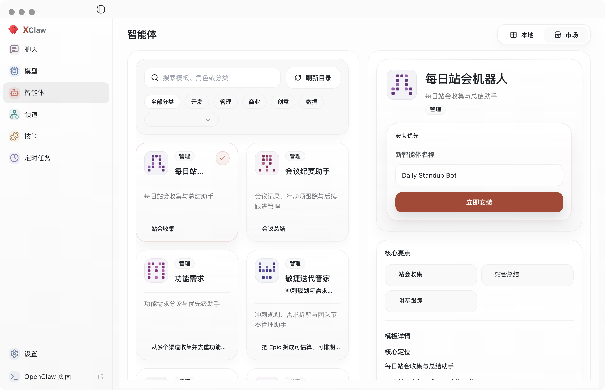
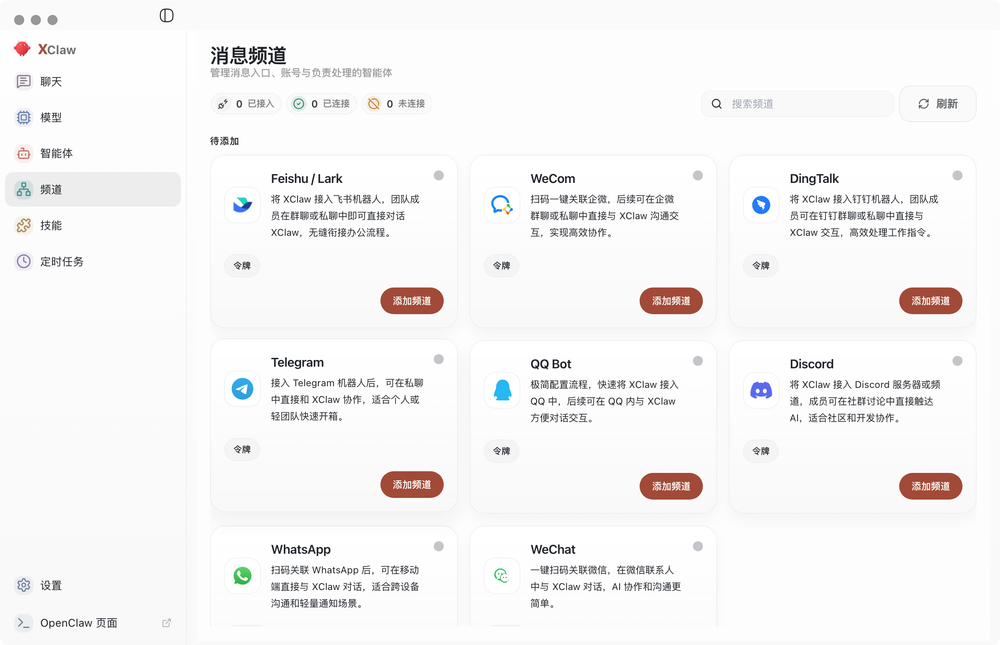
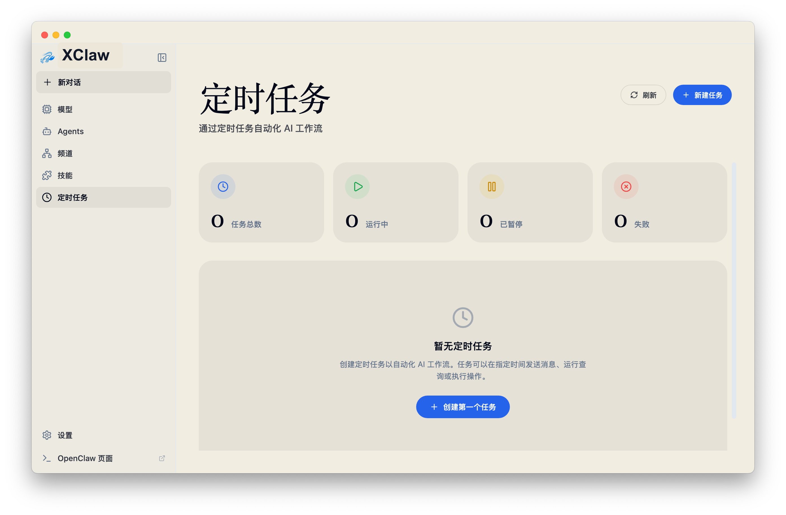
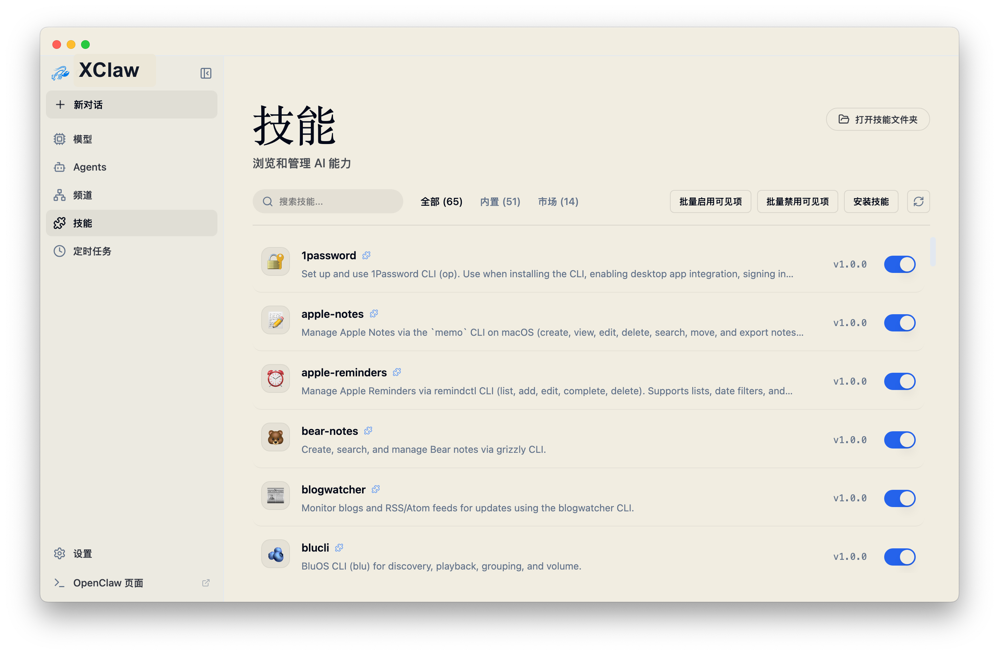
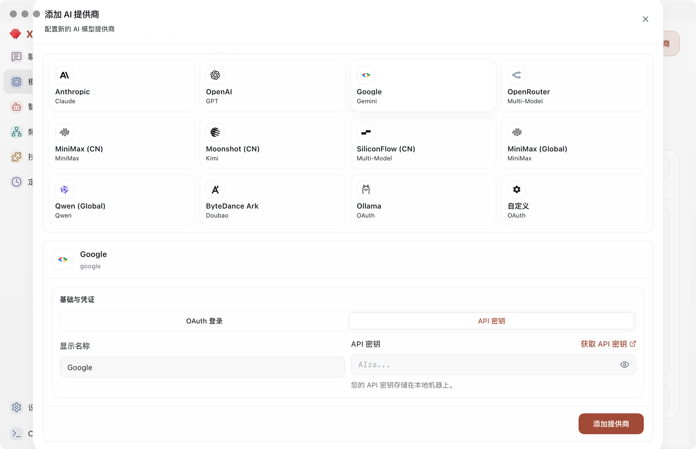
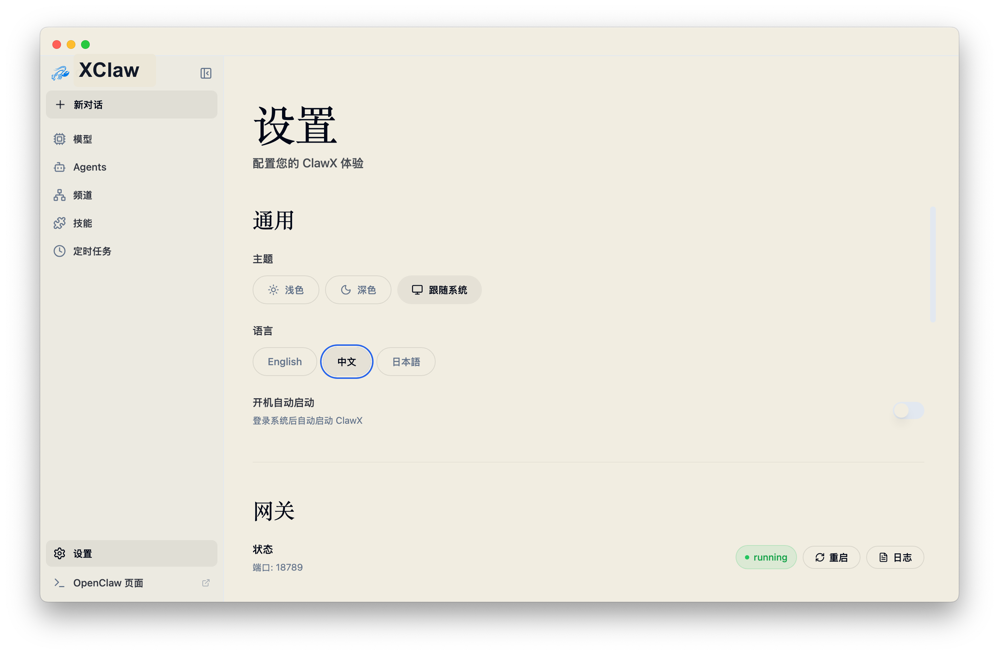

<p align="center">
  
</p>

<h1 align="center">XClaw</h1>

<p align="center">
  <strong>面向 OpenClaw AI 智能体的桌面应用</strong>
</p>

<p align="center">
  <a href="#功能特性">功能特性</a> •
  <a href="#为什么用-xclaw">为什么用 XClaw</a> •
  <a href="#快速开始">快速开始</a> •
  <a href="#参与贡献">参与贡献</a>
</p>

<p align="center">
  
  
  
  
  
</p>

<p align="center">
  <a href="README.md">English</a> | 简体中文
</p>

---

## 简介

**XClaw** 把 [OpenClaw](https://github.com/OpenClaw) 打包成桌面应用，用来做工作流自动化、AI 频道管理和定时智能任务。

它默认带有推荐的模型供应商配置，支持 Windows 和多语言，并把更细的高级入口保留在 **设置 → 高级 → 开发者模式**。

---

## 截图展示

<p align="center">
  
  <p align="center">
  </p>
  
</p>

<p align="center">
  
    <p align="center">
  </p>
  
</p>

<p align="center">
  
    <p align="center">
  </p>
  
</p>

<p align="center">
  
</p>

---

## 为什么用 XClaw

| 常见门槛 | XClaw 的处理方式 |
|----------|------------------|
| CLI 上手复杂 | 提供一键安装和引导式设置 |
| 需要手改配置文件 | 可视化设置并附带实时校验 |
| 进程维护麻烦 | 自动接管 Gateway 生命周期 |
| 多供应商切换繁琐 | 提供自适应 Provider 卡片和 Token Intelligence 工作台 |
| 技能或插件安装麻烦 | 内置技能市场与管理能力 |

---

## 功能特性

### 🎯 接近零门槛的初始化
从安装到发出第一条 AI 消息，都可以在图形界面里完成。你不需要手敲终端命令，也不需要编辑 YAML，环境变量也不用四处找。

### 💬 面向智能体的聊天工作台
聊天区域支持多会话上下文、历史记录、Markdown 富文本展示，以及在多 Agent 场景下通过主输入框里的 `@agent` 直接把消息送到目标智能体。

你还可以使用 OpenClaw 原生的每会话模型覆盖能力，直接切换当前会话模型，而不改动已保存的 provider 配置。

输入框已经带有一套对齐 QClaw 风格的本地 slash command router 和内联命令菜单。`/new` 与 `/reset` 会在本地先被拦截，但仍复用统一的 Gateway 发送链路；`/model`、`/compact`、`/agents`、`/focus`、`/export`、`/usage` 会留在 renderer 侧处理，不再作为普通聊天消息发送。其中 `/usage` 会在会话内直接展示当前 token 摘要，`/focus` 和 `/export` 继续作为桌面动作执行。

当你通过 `@agent` 指向其他智能体时，XClaw 会直接切进那个智能体自己的会话上下文，而不是经过默认智能体转发。各 Agent 工作区默认互相隔离，更强的运行时隔离仍然取决于 OpenClaw 的 sandbox 配置。

### 🏢 全局工作室视图
XClaw 现在提供一个只读工作室视图，入口就在标题栏右上角的 `工作室` 按钮。它会托管本地 Star Office runtime，把主智能体和本地其他智能体汇总到同一个办公室里展示，并把本地运行时事件桥接成实时工作室状态，同时不打断聊天工作台本身的上下文。

### 📡 多频道协同管理
现在每个频道都支持多个账号，也支持在 Channels 页面里直接把账号绑定到指定 Agent，并切换频道默认账号。

XClaw 也已经内置官方微信频道插件，所以新增或重新绑定微信账号时，可以直接走 GUI 扫码登录，不再需要手动执行 `npx` 或 `openclaw`。Channels 工作台会把真实微信账号 ID 保持为只读展示，提供重新扫码入口，并用健康守护提示会话失效风险，而不会主动发送保活消息。

### ⏰ 定时任务自动跑
可以把 AI 任务按计划自动执行。你只需要定义触发条件和执行间隔，剩下的交给智能体持续处理。

### 🧩 可扩展的技能层
XClaw 还会内置完整的文档处理技能（`pdf`、`xlsx`、`docx`、`pptx`），并在启动时自动部署到托管技能目录，默认路径是 `~/.openclaw/skills`，首次安装时会默认启用。额外预装技能（`find-skills`、`self-improving-agent`、`tavily-search`、`brave-web-search`）同样默认开启；如果缺少必需的 API Key，OpenClaw 会在运行时直接给出配置错误提示。

Skills 页面能够同时展示多个 OpenClaw 来源中的技能，包括托管目录、workspace 和额外技能目录。每个技能也会显示真实路径，方便你直接打开实际安装位置。

重点搜索技能相关环境变量：
- `BRAVE_SEARCH_API_KEY`：对应 `brave-web-search`
- `TAVILY_API_KEY`：对应 `tavily-search`（上游运行时也可能支持 OAuth）

### 🔐 安全的供应商接入
OpenAI、Anthropic 等多家 AI 供应商都可以接入，凭证会保存在系统原生密钥链里。OpenAI 既支持 API Key，也支持浏览器 OAuth（Codex 订阅）登录。

### 🌙 自动适配的主题
浅色、深色或跟随系统都可以，XClaw 会按你的主题偏好自动切换。

### 🚀 开机自动启动
如果你希望登录系统后自动打开 XClaw，可以在 **设置 → 通用** 中启用 **开机自动启动**。

---

## 快速开始

### 系统要求

- **操作系统**：macOS 11+、Windows 10+ 或 Linux（Ubuntu 20.04+）
- **内存**：至少 4 GB RAM，推荐 8 GB
- **存储空间**：至少 1 GB 可用磁盘空间

### 安装方式

#### 预编译版本

直接前往 [Releases](https://github.com/jlon/XClaw/releases) 页面，下载与你系统对应的最新安装包。

#### 从源码构建

```bash
# 克隆仓库
git clone https://github.com/jlon/XClaw.git
cd XClaw

# 安装依赖并下载 uv
pnpm run init

# 以开发模式启动桌面应用
pnpm dev
```

如果你在 macOS、Linux、WSL 或 Git Bash 里更习惯短命令，也可以使用新增的可选 `Makefile` 薄包装：

```bash
make package-win
make package-mac-adhoc
make package-linux
make release
```

这个 `Makefile` 只是本地快捷入口，底层仍然会转调现有的 `pnpm run package:*`。如果你是在原生 Windows PowerShell / CMD 环境里使用，仍建议直接执行 `pnpm`，因为默认并没有 GNU Make。

在 Linux 上，`pnpm dev` 现在会自动处理两类常见的无头开发故障：如果触发 `inotify` watcher 上限，会自动回退到 Chokidar polling；如果既没有 `DISPLAY` 也没有 `WAYLAND_DISPLAY`，则保留 Vite 开发服务并跳过 Electron 启动。只有在你已经准备好 Xvfb、VNC 或其他显示服务时，才建议额外设置 `XCLAW_FORCE_ELECTRON_DEV=1` 强制拉起 Electron。

Windows 打包现在会在 `after-pack` 阶段裁掉非目标平台的 `node-llama-cpp` 加速变体，并只保留目标架构的 CPU 预编译包，在不移除 CPU 本地 memory 路径的前提下显著降低安装包体积。

Beta 发布工作流现在默认只发布面向主流 Windows 用户的 x64 安装器；如果你本地确实需要同时打出多个 Windows 架构，仍然可以继续使用 `pnpm run package:win`。

现在打包版 Windows 已恢复 **Beta 通道** 的应用内更新，入口在 **设置 → 更新**。用户可以开启自动检查，并按需启用后台自动下载。macOS Beta 包因为没有 Apple 签名，当前只支持应用内检查新版本，再手动下载安装覆盖。Linux 这一轮仍然保持手动下载安装。

如果你是自托管官网的维护者，不要把官网按钮下载清单和桌面自动更新 feed 混成一条链路。继续使用 `scripts/sync-release-downloads.sh` 同步官网 `latest.json`，再额外使用 `scripts/sync-update-feeds.sh` 同步 `/downloads/updates/beta`。

### 首次启动

第一次打开 XClaw 时，**设置向导** 会依次带你完成：

1. **语言与区域**：选择偏好的地区和语言
2. **AI 供应商**：通过 API Key 或支持时的 OAuth 完成接入
3. **技能包**：挑选常见场景下的预配置技能
4. **验证**：进入主界面前先检查配置是否可用

如果系统语言在支持范围内，向导会优先选中它；如果不支持，则自动回退到英文。

当向导需要准备核心 Python 环境时，这一步现在会保留原位主按钮、展示可折叠的实时安装日志，并支持中途取消，而不再只是把按钮置灰。

> Moonshot（Kimi）说明：XClaw 默认会保持 Kimi web search 为开启状态。
> 当你配置了 Moonshot 后，XClaw 也会把 OpenClaw 配置里的 Kimi web search 同步到中国区端点（`https://api.moonshot.cn/v1`）。

---

## 参与贡献

### 贡献流程

1. **Fork** 本仓库
2. **创建** 功能分支（`git checkout -b feature/amazing-feature`）
3. **提交** 清晰描述的改动
4. **推送** 你的分支
5. **发起** Pull Request

### 贡献建议

- 遵循现有代码风格（`ESLint + Prettier`）
- 新增行为尽量补上测试
- 需要时同步更新文档
- 提交尽量聚焦、描述尽量明确

---

## 社区

<p align="center">
  
</p>

合作咨询：上方微信或邮箱 [itjlon@gmail.com](mailto:itjlon@gmail.com)。

---

## 许可证

XClaw 基于 [MIT 许可证](LICENSE) 发布，你可以自由使用、修改并分发这套软件。

---
