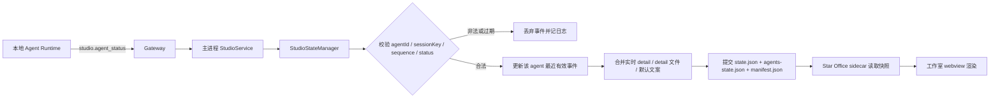

# Star Office 集成设计

## 问题背景

XClaw 当前已经有成熟的聊天、智能体工作台、setup 接管和 `uv + managed Python` 运行时能力，但还没有一个“工作可视化总览”页面，用户无法在桌面应用内直观看到：

- 主智能体当前是否在工作
- 本地多个智能体当前处于什么状态
- 所有智能体是否汇聚在同一个统一工作室里

现有的 `Star-Office-UI` 已经提供了成熟的像素办公室可视化能力，但它本质上不是 React 组件库，而是一套：

- Python/Flask 本地服务
- 静态前端页面
- 基于 JSON 文件的状态读写

因此，本功能不是“把一个 React 页面复制进 XClaw”，而是要把 `Star-Office-UI` 裁剪成一个由 XClaw 托管的最小运行时，并以内嵌页面的方式展示。

## 本轮设计结论

本功能按以下产品边界落地：

- 工作室是全局工作室，不跟随某个聊天会话单独变化
- 聊天页与工作室页通过标题栏右上角统一入口切换，工作室实际对应独立路由
- `Star-Office-UI` 以最小化 vendoring 的方式打包进 XClaw
- XClaw 启动时后台拉起工作室 sidecar，但不阻塞主界面进入
- 工作室页面只读展示，不开放装修、资产编辑、访客管理等控制入口
- 本地智能体状态由 XClaw 主进程自动维护
- 当前聊天中的 agent 在工作室场景内只做弱标记，不做持续高亮、不切成单 agent 详情页
- 提示词注入只负责补充 `detail` 语义，不负责主状态切换
- 提示词注入只写入 `AGENTS.md`
- 注入必须幂等，不能重复追加相同规则块

## 目标

- 在 XClaw 内提供一个稳定、全局的工作室页面
- 让主智能体和本地 agent 都能显示在同一个办公室场景中
- 复用 XClaw 现有 `uv + managed Python 3.12` 准备逻辑
- 将 `Star-Office-UI` 新增体积控制在“只读工作室所需最小资源”范围内
- setup 新建、setup 接管、智能体工作台新增 agent 三条链路都支持自动注入工作室规则
- 注入逻辑必须幂等，不能重复注册同一提示词块

## 非目标

- 不在 v1 重写 `Star-Office-UI` 为原生 React 页面
- 不在 v1 开放装修、Gemini、生图、资产抽屉、访客审批等高级能力
- 不在 v1 提供单 agent 过滤视图或聚焦模式
- 不在 v1 让本地 agent 伪装成远端访客走 `join-agent` / `agent-push`
- 不在 v1 通过 `SOUL.md` 注入工作室规则
- 不在 v1 自动修复损坏的注入标记块

## 方案选择

### 方案 A：最小 vendoring + 受管 sidecar + 只读 `webview` 嵌入

做法：

- 将 `Star-Office-UI` 裁剪为最小运行时资源随 XClaw 打包
- 由 XClaw 主进程后台拉起独立 Flask 服务
- renderer 通过只读 `webview` 展示工作室页面
- XClaw 主进程直接维护 `state.json` / `agents-state.json`

优点：

- 边界清晰
- 对现有 XClaw React 架构侵入小
- 最大化复用 `Star-Office-UI` 现有视觉效果
- 后续升级 vendored runtime 时成本可控

缺点：

- 仍然是双运行时模型，Electron 与 Python 需要共同维护

结论：

采用。

### 方案 B：最小 vendoring + 通过 HTTP 调用 `Star-Office-UI` 本地接口同步状态

优点：

- 看起来更贴近 `Star-Office-UI` 的现有接口设计

缺点：

- 本地状态同步多一层无必要网络调用
- 本地异常链路更长
- 不能利用 XClaw 主进程已有的状态主事实源

结论：

不采用。

### 方案 C：重写为原生 React 工作室

优点：

- 最统一
- 后续扩展自由度最高

缺点：

- 明显超出 v1
- 偏离 upstream
- 成本和风险都过高

结论：

不采用。

## 资源最小化策略

### 保留资源

仅保留只读工作室运行所必需的内容：

- `backend/app.py`
- `backend/memo_utils.py`
- `backend/security_utils.py`
- `backend/store_utils.py`
- `backend/requirements.txt`
- `frontend/electron-standalone.html`
- `frontend/vendor/phaser-3.80.1.min.js`
- 只读场景实际加载的静态素材与字体
- XClaw 侧初始化生成的默认状态模板

### 明确裁掉的资源

以下内容不进入 XClaw 打包产物：

- `desktop-pet/`
- `electron-shell/`
- `docs/`
- `dist/`
- `scripts/`
- `frontend/join.html`
- `frontend/invite.html`
- `frontend/office-agent-push.py`
- `frontend/join-office-skill.md`
- 字体压缩包等纯分发辅助文件
- 装修流程不需要的额外发布材料

### 目录形态

建议在 XClaw 产物中拆成两类目录：

- 只读 runtime 目录：存放 vendored `Star-Office-UI` 代码和静态资源
- 可写 data 目录：存放 `state.json`、`agents-state.json`、`manifest.json`、`join-keys.json`、`.venv/`

这样可以避免：

- macOS 应用包内资源不可写
- Windows 安装目录权限问题
- 升级安装时覆盖用户运行态数据

## 总体架构

### 1. `StudioRuntimeManager`

主进程新增工作室运行时管理器，职责包括：

- 解析工作室 runtime 目录与 data 目录
- 检查 runtime 资源是否完整
- 在应用启动时后台拉起 Flask sidecar
- 进行健康检查
- 管理端口分配、停止、重试和错误态

关键原则：

- 工作室随应用启动，但不得阻塞聊天页进入
- sidecar 启动失败时，XClaw 主功能仍可正常使用

### 2. `StudioStateManager`

主进程新增状态同步管理器，职责包括：

- 维护主智能体 `state.json`
- 维护本地 agent `agents-state.json`
- 将 XClaw 运行时事件映射为工作室状态
- 从 `STAR_OFFICE_DETAIL.txt` 或其他回退来源补充 `detail`

本管理器是工作室状态的唯一主事实源，且主进程是唯一落盘写入者。renderer 只消费结果，不直接写状态；agent 也不直接写 `state.json` 或 `agents-state.json`，只通过现有运行时事件与工作区文件间接影响状态展示。

### 共享状态文件写入协议

由于 sidecar 会直接读取 `state.json` 与 `agents-state.json`，v1 必须明确共享文件契约：

- `state.json`、`agents-state.json` 与 `manifest.json` 共同组成一个逻辑快照单元
- 三个文件都带显式 `schemaVersion`
- `state.json` 与 `agents-state.json` 都带同一个 `generation`
- `manifest.json` 是唯一提交标记，sidecar 只承认 manifest 指向的那一代快照
- 主进程写入时使用同目录临时文件
- 临时文件写完并通过基础校验后，再原子替换正式文件
- `manifest.json` 必须最后替换，作为“一组快照已提交”的唯一信号
- 当前代成功提交后，再整体更新一份 `last-known-good` 三件套备份
- sidecar 读取时先校验 manifest，再读取同代的 `state.json` 与 `agents-state.json`
- 若正式快照损坏或代际不一致，则只回退到 `last-known-good` 中保存的那一整代三件套，不允许混读

这样可以避免：

- sidecar 读到半截 JSON
- 进程异常退出后状态文件不可解析
- 两个状态文件分属不同提交代导致展示撕裂
- 后续 schema 演进时缺少兼容边界

### v1 快照 schema

`state.json` 只描述主智能体，字段职责固定如下：

```json
{
  "schemaVersion": 1,
  "generation": 12,
  "updatedAt": "2026-03-24T10:00:00.000Z",
  "owner": "xclaw-main",
  "agent": {
    "agentId": "main",
    "displayName": "Main Agent",
    "status": "writing",
    "detail": "正在整理工作室集成设计",
    "detailSource": "detail-file",
    "updatedAt": "2026-03-24T10:00:00.000Z"
  }
}
```

`agents-state.json` 只描述本地其他 agent，字段职责固定如下：

```json
{
  "schemaVersion": 1,
  "generation": 12,
  "updatedAt": "2026-03-24T10:00:00.000Z",
  "owner": "xclaw-main",
  "agents": [
    {
      "agentId": "agent-1",
      "displayName": "Planner",
      "status": "researching",
      "detail": "正在阅读集成文档",
      "detailSource": "event-summary",
      "updatedAt": "2026-03-24T10:00:00.000Z"
    }
  ]
}
```

`manifest.json` 用来确认哪一代快照已经完整提交：

```json
{
  "schemaVersion": 1,
  "generation": 12,
  "committedAt": "2026-03-24T10:00:00.000Z",
  "owner": "xclaw-main",
  "files": {
    "main": "state.json",
    "agents": "agents-state.json"
  }
}
```

字段职责约束：

- `owner` 固定为 `xclaw-main`，用于强调主进程是唯一写入者
- `status` 只允许 `idle | writing | researching | executing | syncing | error`
- `detailSource` 只允许 `detail-file | event-summary | default`
- sidecar 只读取这些字段并在内存中转换为上游页面需要的展示模型，不回写、不补字段
- renderer 与 agent 都不得直接修改这三份文件

兼容规则：

- v1 sidecar 仅接受 `schemaVersion = 1`
- 必填字段缺失或枚举值非法时，整个快照判定为无效
- 同版本下允许新增可选字段，但 sidecar 必须忽略未知字段
- 破坏性 schema 变更必须提升 `schemaVersion`，不能靠猜测兼容

### v1 提交流程

一次完整写入必须遵循以下顺序：

1. 计算下一代 `generation`
2. 生成 `state.json.tmp` 与 `agents-state.json.tmp`
3. 对两个临时文件分别做 JSON 完整性、必填字段和枚举值校验
4. 原子替换正式 `state.json` 与 `agents-state.json`
5. 生成并原子替换 `manifest.json`
6. 将当前代完整快照复制为 `last-known-good` 三件套

sidecar 读取流程固定如下：

1. 先读取 `manifest.json`
2. 取出其中声明的 `generation`
3. 读取 `state.json` 与 `agents-state.json`
4. 只有当两者的 `generation` 都与 manifest 一致时，才接受这组快照
5. 若出现文件缺失、schema 非法或代际不一致，则重试一次
6. 重试仍失败时回退到 `last-known-good` 中最近一次完整提交的三件套

这个提交模型的关键点不是“每个文件各自原子”，而是“manifest 最后提交，sidecar 只认 manifest 指向的完整一代”。

### 3. `StudioPromptInjector`

新增统一的提示词注入工具，职责包括：

- 对主工作区 `AGENTS.md` 做幂等注入
- 对新建 agent 工作区 `AGENTS.md` 做幂等注入
- setup 新建与 takeover 时复用同一套注入逻辑

关键原则：

- 只注入 `AGENTS.md`
- 不注入 `SOUL.md`
- 已存在完整标记块时直接跳过

### 4. renderer 工作室页面

renderer 新增 `/studio` 路由与页面容器，职责包括：

- 展示工作室运行态与右上角返回入口
- 根据工作室运行态展示 `starting / restarting / ready / python-missing / runtime-error`
- 在 `ready` 态下通过 `webview` 加载只读工作室页面

## 路由与导航设计

### 右上角入口

在聊天页与工作室页标题栏右上角统一显示单个入口按钮：

- 聊天页显示 `工作室`
- 工作室页显示 `对话`

行为上对应路由切换：

- `工作室` -> `/studio`
- `对话` -> 当前聊天页

这样做的原因：

- 工作室是全局视图，不应该跟某个 session 的 DOM 生命周期绑死
- 不需要改原生标题栏 chrome 或页面内分段控件
- 不会破坏当前聊天页的流式状态、滚动状态和输入状态

### `对话` 返回目标

由于工作室是全局路由，`对话` 的返回目标必须固定：

- 优先返回“最后激活的聊天会话路由”
- 若当前没有可恢复的聊天会话，则回到聊天首页

这里不允许让 `/studio` 的返回目标依赖当前 UI 猜测的 session，否则全局工作室会被局部界面状态污染。

## 工作室只读嵌入设计

### 承载方式

工作室页面固定采用 Electron `webview` 承载 vendored `Star-Office-UI` 页面，不使用 `iframe`、`file://` 或 renderer 直接拼接 localhost URL。

选择 `webview` 的原因：

- XClaw 当前主窗口已启用 `webviewTag`
- 工作室页面与主 renderer 上下文隔离，边界更清晰
- 不需要让 renderer 自己直接访问本地 sidecar HTTP
- 更符合现有“主进程拥有本地服务地址解析权”的架构边界

对应约束：

- renderer 不直接拼接 `http://127.0.0.1:<port>`
- renderer 通过主进程暴露的受控接口获取最终工作室 URL
- `webview` 仅用于工作室只读页面，不扩展为通用页面容器

### 主进程到 renderer 的 handoff 契约

工作室页面的运行时信息必须只通过既有 host-api 边界下发，renderer 不得自行推断。

v1 固定两类接口：

- 快照读取接口
  - 通过 `src/lib/host-api.ts` / `src/lib/api-client.ts` 暴露 `getStudioRuntimeSnapshot()`
  - 返回值至少包含：
    - `status`: `starting | restarting | ready | python-missing | runtime-error`
    - `resolvedUrl`: `string | null`
    - `runtimeInstanceId`: `string | null`
    - `lastError`: `string | null`
- 运行态变化事件
  - 主进程在 runtime 状态、端口或实例发生变化时广播 `studioRuntimeChanged`
  - payload 与快照字段保持同构，避免 renderer 再拼状态

renderer 固定行为：

- 页面挂载时先拉取一次快照
- 收到 `studioRuntimeChanged` 后，用最新快照整体替换本地状态
- 只有 `status = ready` 且 `resolvedUrl` 非空时才挂载 `webview`
- `runtimeInstanceId` 变化时销毁旧 `webview` 并重新创建，不能复用旧实例硬切地址
- 状态降回非 `ready` 时立即卸载 `webview`，回到宿主错误态 UI

重试与修复阶段的线协议固定如下：

- 用户点击“重试运行时”后，主进程先进入 `restarting`
- 若本次重试带 `repairEnvironment=true`
  - renderer 可以在 `restarting` 期间显示“环境初始化中”遮罩
  - 不额外引入独立 `repairing` 状态
- `restarting -> ready`
  - 表示 sidecar 成功恢复
- `restarting -> python-missing`
  - 表示 Python / 依赖修复失败
- `restarting -> runtime-error`
  - 表示 sidecar 重启后健康检查仍失败

### `webview` 导航与权限边界

`webview` 只是只读工作室的受控容器，导航和权限必须收死：

- 仅允许加载主进程下发的 `resolvedUrl`
- 仅允许同源导航到 `http://127.0.0.1:<studioPort>` 或 `http://localhost:<studioPort>` 下的白名单路径
- 任何跳转到其他 origin 的导航都必须被拦截并拒绝
- 禁止 `new-window`、任意外链打开和下载行为
- 使用专用隔离 session，不复用主 renderer 的会话上下文
- 不为 `webview` 暴露额外 preload 能力，只保留展示必需的默认能力

v1 白名单固定如下：

- 页面路径
  - `/electron-standalone`
- 只读 GET 接口
  - `/health`
  - `/status`
  - `/agents`
  - `/yesterday-memo`
- 静态资源前缀
  - `/static/`

白名单之外一律拒绝，不允许靠“同源即可访问”放行其它页面或接口。

失败降级规则：

- sidecar 重启或端口重分配后，由主进程重新计算 `resolvedUrl` 并广播新快照
- renderer 只依据 `runtimeInstanceId` 变化执行重挂载，不直接比较端口字符串
- 若 `webview` 加载超时、崩溃或被导航拦截，则回退到工作室错误态，并允许用户触发重试

### 只读模式补丁

对 vendored `frontend/electron-standalone.html` 做最小 patch，新增：

- `embedded=1`
- `readonly=1`

在只读模式下隐藏：

- 状态控制栏
- 资产抽屉
- 搬家 / DIY / broker / Gemini 入口
- guest 列表里的操作按钮
- 其他会产生写操作的 UI

保留：

- 像素办公室场景
- 主智能体与本地 agent 的展示
- 访客列表的只读摘要

### 后端硬禁写

v1 的“只读”不能只靠隐藏按钮实现，必须同时在 vendored sidecar 后端加硬性禁写约束。

约束方式：

- sidecar 以只读模式启动
- 所有会修改状态、资产或运行配置的写接口在只读模式下统一拒绝
- 只保留工作室展示所需的读接口，例如健康检查、主状态读取、多 agent 列表读取

这意味着：

- 工作室页面即使被直接构造请求，也不能通过 sidecar 写入状态
- 状态写入唯一仍由 XClaw 主进程完成

## 运行时与端口策略

### 启动策略

工作室 sidecar 在 XClaw 启动时后台拉起。

但必须满足：

- 不等待它完成才进入主界面
- 启动慢时只影响工作室页
- 聊天、设置、工作台等核心页面不被阻塞

### 端口策略

不复用 XClaw 现有端口。

原因：

- `Star-Office-UI` 本质是独立 Flask 服务
- 强行复用 XClaw host-api 或 renderer 端口会打乱边界
- 后续维护成本显著升高

定稿策略：

- 工作室 sidecar 使用独立 localhost 专用端口
- 该端口由 XClaw 主进程持久化管理，例如 `studioPort`
- 默认从一个专用起始端口开始探测，例如 `19001`
- 若该端口被占用，则顺序探测下一个空闲端口并立即持久化
- 一旦成功分配，后续启动优先复用已持久化端口

这样可以同时满足：

- 避开 upstream `Star-Office-UI` 常见默认端口 `19000`
- 保持日志、健康检查和错误定位的稳定性
- 避免每次启动都临时漂移端口

对应约束：

- renderer 不感知端口选择逻辑
- renderer 只消费主进程返回的最终工作室 URL

## Python 运行时策略

工作室 sidecar 复用 XClaw 现有 setup 里的 `uv + managed Python 3.12` 逻辑。

### 分层就绪判定

“Python 已就绪”不能只等价于 `uv python find 3.12` 成功，v1 需要拆成三层判断：

1. 解释器就绪
   - `uv` 可用
   - `uv python find 3.12` 成功
2. 依赖就绪
   - vendored runtime 所需 Python 依赖已经安装完成
3. sidecar 可启动
   - 以只读模式执行一次最小 smoke test，确认 Flask 服务能真正启动并通过健康检查

只有三层都满足，工作室 runtime 才能进入 `ready`。

### 行为定义

- 仅解释器就绪但依赖未就绪：视为未完成准备
- 解释器与依赖就绪但 smoke test 失败：视为 runtime 错误，不误判为 ready
- 若未完全就绪，则通过现有 `uv:install-all` 和工作室自身依赖准备流程补齐环境

### UI 降级

当 Python 未就绪时：

- 聊天页仍可正常使用
- 工作室页展示“环境未就绪”
- 提供通向现有准备流程的操作入口

## 状态同步设计

### 状态来源

工作室状态由 XClaw 主进程自动推导，不要求 agent 自己切换主状态。

v1 状态映射采用确定性状态机，不允许不同实现自由解释。

#### 唯一收敛规则

这里必须明确只采用一套算法：

- 每个 agent 同一时刻只有一个“当前有效状态槽”
- 主进程不维护“多个活动事件集合”再做优先级归并
- 最新被接受的有效事件直接覆盖该 agent 之前的状态
- 旧事件、失效事件和非法事件一律不能回写当前状态

也就是说：

- 当前模型是“最新有效事件胜出”
- 不是“多个候选状态按优先级同时收敛”

#### 转移规则

- 出现错误事件：立即进入 `error`
- 出现命令执行事件：进入 `executing`
- 出现搜索 / 浏览类事件：进入 `researching`
- 出现输出生成或文本撰写事件：进入 `writing`
- 出现同步类内部动作：进入 `syncing`
- 当不存在仍处于有效窗口内的活动事件时：回落到 `idle`

#### 活动窗口与回落

- 每个状态事件都带时间戳
- 主进程只保留每个 agent 最近一次有效活动事件
- 非 `error` 状态超过固定活动窗口后自动失效
- `error` 状态保留到下一次成功活动事件覆盖，或由显式恢复逻辑清除
- 当所有非空闲状态都失效后，统一回落为 `idle`

#### 冲突处理

- 乱序到达的旧事件不能覆盖更新事件
- 同一 agent 不存在“同优先级再比较”的第二层归并
- 不允许 renderer 再次做本地二次推导

- 会话输出中 -> `writing`
- 搜索 / 浏览 / 调研类工具 -> `researching`
- 命令执行 / 任务执行类工具 -> `executing`
- 同步类内部动作 -> `syncing`
- 运行错误 -> `error`
- 空闲或完成后回落 -> `idle`

### 本地 agent 展示方式

本地 agent 由主进程代表它们写入 `agents-state.json`，不走 `/join-agent` / `/agent-push` 的远端访客链路。

原因：

- 远端访客机制包含 joinKey、审批、离线恢复等本地不需要的复杂状态机
- XClaw 本地 agent 已有稳定 agent id，可直接作为工作室 agent id 使用
- 能保证主进程成为唯一状态写入者，避免并发冲突

### v1 当前落地合约

当前版本不是“所有本地 agent 都只显示为 `idle`”的静态 mixed-mode，而是分成两层：

- 主事实源仍然是主进程单写者快照模型
- 本地 agent 的实时状态优先来自 gateway 现有 `agent` notification 的内部桥接
- 若未来 runtime / gateway 原生发出 `studio.agent_status`，则该 agent 的显式协议事件优先于桥接事件
- 当某个 agent 当前没有任何可接受的实时事件时，才回退到 `detail-file + default` 的静态展示

也就是说：

- 已经不再依赖“只有 main agent 有实时态，其它 agent 永远 idle”这套旧行为
- 但也没有让本地 agent 直接写共享状态文件或直接调 sidecar 接口
- 当前落地的是“XClaw 内部桥接闭环”，不是“每个 runtime 都原生实现 sender”

- agent registry 是本地 agent 清单的唯一事实源
- 以下生命周期必须触发一次 inventory 刷新：
  - 应用启动
  - setup fresh
  - setup takeover
  - 新增 agent
  - 删除 agent
  - 修改 agent 名称或工作区路径
- 有 gateway `agent` 事件时：
  - 主进程会把其中的 `runId / sessionKey / phase / seq / state / message` 桥接成内部实时状态事件
  - `phase=started` 但尚无消息体时，进入 `syncing`
  - 明确搜索 / 浏览类工具进入 `researching`
  - 其它工具事件进入 `executing`
  - 文本输出事件进入 `writing`
  - `phase=completed|done|finished|end` 立即回落到 `idle`
- 无 agent 级实时事件时：
  - `main` 回退到现有 gateway 粗粒度 `chat/tool/agent` 事件映射
  - 本地其他 agent 回退到 `idle`
- 本地其他 agent 的 `detail`
  - 先读各自 workspace 下的 `STAR_OFFICE_DETAIL.txt`
  - 再回退到默认文案
- 某个 agent 被删除后：
  - 下一次快照提交必须立即把它从 `agents-state.json` 移除
  - 不允许保留“幽灵 agent” 直到重启才消失

### 多 agent 实时状态协议

这一节定义的是完整实时协议。当前仓库已经落地了主进程接收侧与基于 gateway `agent` 事件的内部桥接；未来若 runtime / gateway 增加原生 sender，则继续复用同一协议，不再新增第二套写入链路。

它不是另起一套写入链路，而是在现有主进程单写者模型上补一层稳定事件协议。

#### 设计目标

- 让 main agent 和本地其他 agent 都能实时更新 `status` 与 `detail`
- 继续保持主进程是唯一快照写入者
- 不允许 agent 直接写 `state.json` / `agents-state.json`
- 不允许 renderer 自行推导 agent 状态
- 不复用远端访客的 `/join-agent` / `/agent-push` 协议

#### 不采用的方案

这里需要先否定两条看起来省事、实际上会把系统搞乱的路：

- 让每个 agent 直接写共享状态文件
  - 这会破坏单写者模型，manifest 同代提交协议会立刻失效
- 让每个 agent 直接调用 sidecar 的 `/agent-push`
  - 这会把工作室 sidecar 变成状态事实源，主进程与 sidecar 会双写冲突

因此正确方案只能是：

- agent runtime 产生标准化状态事件
- gateway 把事件转发到主进程
- 主进程 `StudioStateManager` 做校验、排序、合并、落盘

当前仓库的实际落地形态是：

- 先利用 gateway 已有的 `agent` notification 做内部桥接，补齐本地闭环
- 后续若 upstream 增加原生 `studio.agent_status` sender，直接切到显式协议优先，不改快照模型

#### 协议承载层

采用 gateway 的 JSON-RPC notification 通道承载，新增固定方法名：

`studio.agent_status`

这样做的原因很直接：

- 主进程已经稳定订阅 gateway notification
- 不需要额外新增 renderer 到主进程、agent 到 sidecar 的新连接
- 能和现有 runtime 生命周期、日志和错误处理保持一致

#### 事件格式

事件体固定为：

```json
{
  "jsonrpc": "2.0",
  "method": "studio.agent_status",
  "params": {
    "schemaVersion": 1,
    "agentId": "pangtong",
    "sessionKey": "agent:pangtong:main",
    "sessionStartedAt": "2026-03-24T09:58:00.000Z",
    "sequence": 42,
    "status": "researching",
    "detail": "正在阅读 Star Office 集成设计",
    "timestamp": "2026-03-24T10:00:00.000Z",
    "ttlMs": 90000,
    "final": false
  }
}
```

字段约束如下：

- `schemaVersion`
  - 当前固定为 `1`
- `agentId`
  - 必须是合法主体 id，合法集合为 `{main} ∪ 本地已配置 agent id 集合`
- `sessionKey`
  - 必填，表示该 agent 当前状态流实例；agent 重启或重新接管状态发送职责时必须生成新的 `sessionKey`
- `sessionStartedAt`
  - 必填，表示该状态流的启动时间；主进程只用它来判定哪个 `sessionKey` 是当前活动流
- `sequence`
  - 必须在 `(agentId, sessionKey)` 作用域内单调递增
- `status`
  - 只能取 `idle | writing | researching | executing | syncing | error`
- `detail`
  - 可选短句，最长按主进程截断到 120 字符
- `timestamp`
  - 事件产生时间，使用 ISO 字符串
- `ttlMs`
  - 可选，表示该状态的有效期；缺失时由主进程按状态类型套默认窗口
- `final`
  - 可选，若为 `true`，则 `status` 必须同时为 `idle`

额外约束：

- 同一 agent 在同一时刻只允许一条活动状态流
- 若主进程观察到同一 `agentId` 存在多个 `sessionKey` 并发发事件：
  - 只接受 `sessionStartedAt` 更新的那条流
  - 若 `sessionStartedAt` 相同，则按 `sessionKey` 字典序取较大者作为 tie-breaker
  - 其它流记 warning 并丢弃
- 不要求 `sequence` 跨重启持久化；重启后的新流靠新的 `sessionKey` 隔离旧序号空间
- `final = true` 时：
  - `detail` 与 `ttlMs` 统一忽略
  - 只作用于当前 active `sessionKey`
  - 主进程立即将该 agent 回落到 `idle`

#### 主进程处理规则

`StudioStateManager` 对每个 agent 维护一份最近有效事件缓存，处理顺序固定如下：

1. 校验 `schemaVersion`、`agentId`、`status`、`sessionKey`、`sessionStartedAt`、`sequence`
2. 若 `agentId` 不在合法主体集合 `{main} ∪ 本地 agent id 集合` 中，丢弃
3. 若该事件来自较旧的 `sessionKey`，丢弃
4. 若 `sequence` 小于等于该 `(agentId, sessionKey)` 最近已接受事件，丢弃
5. 接受新事件并更新该 agent 的活动状态
6. 若 `final = true`，立即把该 agent 置为 `idle`
7. 否则根据 `ttlMs` 或默认活动窗口判断是否仍然有效
8. 将有效事件映射为 `StudioAgentSnapshot`
9. 若 `agentId = main`，更新 `state.json`
10. 若 `agentId != main`，更新 `agents-state.json` 中对应条目
11. 统一提交到 `state.json + agents-state.json + manifest.json`

这里要明确：

- 排序主键是 `(agentId, sessionKey, sequence)`
- `sessionStartedAt` 决定 active session 切换
- `timestamp` 只用于辅助过期判断和日志，不承担同流内乱序决策职责

#### 默认 TTL 与过期驱动

为避免不同实现各自猜测活动窗口，默认 TTL 固定如下：

| 状态 | 默认 TTL |
|------|----------|
| `writing` | `90000ms` |
| `researching` | `90000ms` |
| `executing` | `120000ms` |
| `syncing` | `30000ms` |
| `error` | 不自动过期 |
| `idle` | 不适用 |

过期驱动规则固定如下：

- `StudioStateManager` 必须维护“下一次最早过期时间”
- 到达该时间点时，即使没有新事件，也必须主动重新计算所有 agent 的有效状态并重新提交快照
- 非 `error` 状态过期后自动回落到 `idle`
- `error` 只会被以下两种方式清除：
  - 收到新的成功状态事件覆盖
  - 收到显式 `final = true` 的收尾事件
- sender 可以通过 `ttlMs` 缩短默认窗口，但不能放大超过主进程允许的上限；上限由实现阶段统一写死

这样可以保证：

- 没有显式收尾事件时，状态也能按协议自动回落
- 测试与联调时，对同一状态的回落时机会有固定预期

#### `detail` 合并规则

多 agent 实时协议补进来以后，`detail` 优先级必须调整，否则实时事件会被旧文件遮住。

正确优先级应改为：

1. 该 agent 当前有效实时事件自带的 `detail`
2. 工作区 `STAR_OFFICE_DETAIL.txt`
3. 该 agent 最近一次有效状态事件摘要
4. 默认回退文案

工作区解析契约固定如下：

- `main`
  - 读取 OpenClaw 默认工作区根目录下的 `STAR_OFFICE_DETAIL.txt`
- 本地其他 agent
  - 读取该 agent 自己 workspace 根目录下的 `STAR_OFFICE_DETAIL.txt`
- workspace 路径统一来自现有 agent registry / OpenClaw config 解析结果
- 若 workspace 不存在、不可读或文件缺失，则跳过该层回退

这样可以同时满足两件事：

- agent 正在执行任务时，工作室能实时显示当前动作
- agent 没有实时事件时，仍能回退到工作区里那条长期说明

#### 降级与兼容策略

协议上线必须允许渐进接入，不能要求 runtime 一夜之间全部升级。

兼容阶段按三层回退：

1. 若 runtime 发出 `studio.agent_status`
  - 主进程优先使用该协议
2. 若只有现有 gateway 粗粒度事件
  - main agent 继续按现有映射规则推导
3. 若既无实时协议也无有效事件
  - 回退到 `STAR_OFFICE_DETAIL.txt` 和默认文案

这意味着：

- 当前已上线版本不会因为协议未实现而失效
- 新协议落地后也不需要推翻现有快照与 sidecar 读取模型

#### 时序流程图



#### 责任边界

- agent runtime 负责产生标准化事件
- gateway 负责透明转发
- 主进程负责校验、排序、状态机、快照落盘
- sidecar 只读快照并渲染
- renderer 只展示 runtime 状态与工作室页面，不推导业务状态

这个边界不能再打破，否则工作室状态会重新退回“双写 + 多处推导”的混乱状态。

### `detail` 来源优先级

按以下优先级生成展示文案：

1. 该 agent 当前有效实时事件自带的 `detail`
2. 工作区 `STAR_OFFICE_DETAIL.txt`
3. 该 agent 最近一次有效状态事件摘要
4. 默认回退文案

这里的“状态事件摘要”必须来自该 agent 自己最近一次状态事件上下文，而不是当前 UI 正在浏览的聊天会话；否则全局工作室会被局部页面状态污染。

## 提示词注入设计

### 注入目标

仅注入 `AGENTS.md`。

不注入 `SOUL.md`，因为：

- `AGENTS.md` 更适合承载工作流规则
- `SOUL.md` 更适合人格与行为准则
- 将工作室同步规则写进 `SOUL.md` 会混淆职责

### 注入时机

需要覆盖三条链路：

1. setup 新建流程完成时
2. setup takeover 现有 OpenClaw 时
3. 智能体工作台新增 agent 时

### 注入规则块

建议采用固定标记块，例如：

```md
## XClaw Star Office

<!-- XCLAW:STAR_OFFICE:BEGIN -->
...规则正文...
<!-- XCLAW:STAR_OFFICE:END -->
```

### 幂等策略

- 找到完整 `BEGIN + END`：视为已注入，直接跳过
- 完全不存在标记块：注入一次
- 只有单边标记：视为损坏，不自动补第二份，提示可修复

这里的关键结论是：

- 幂等插入
- 不自动覆盖用户已存在的完整块
- 不允许重复追加同一规则块

## `STAR_OFFICE_DETAIL.txt` 设计

为避免让 agent 负责主状态切换，工作室规则只要求 agent 在合适时机维护一份轻量 detail 文件：

- 文件名：`STAR_OFFICE_DETAIL.txt`
- 内容：一行短句
- 作用：辅助工作室气泡和状态文案

它的职责仅是补充描述，不承担状态机职责。

## 失败与降级设计

### 注入失败

- setup 阶段：不阻塞整个 XClaw 使用，但记录“工作室未完成配置”
- 新增 agent 阶段：agent 可以继续创建成功，但工作台需要给出警告和修复入口

### runtime 启动失败

- 主功能不受影响
- 工作室页展示错误态
- 提供重试和查看日志入口

### detail 文件缺失

- 直接回退到自动摘要或默认文案
- 不中断工作室展示

## 测试与验收要求

至少覆盖：

- `AGENTS.md` 注入幂等
- 损坏标记块检测
- setup 新建与 takeover 自动注入
- 新增 agent 自动继承且不重复
- 工作室 sidecar 启动、降级和重试
- `state.json + agents-state.json + manifest.json` 的同代提交与 `last-known-good` 回退
- 状态映射
- v1 当前混合模式下的 inventory refresh、默认 `idle` 与幽灵 agent 清理
- `/studio` 路由和右上角入口跳转
- `webview` handoff、`runtimeInstanceId` 重建与 allowlist 拦截
- 只读工作室隐藏所有写操作入口

## 复杂度评估

复杂度：中等偏上

主要复杂度不在 UI，而在：

- 最小化 vendoring
- Python sidecar 托管
- 幂等注入
- 主进程状态同步边界

## 完成标准

满足以下条件才算 v1 完成：

1. XClaw 启动后能后台尝试拉起工作室 sidecar
2. 聊天页和工作室页可通过右上角入口稳定切换
3. 工作室页能展示全局办公室
4. 工作室页只读，不暴露装修与管理操作
5. 主智能体和本地 agent 都能显示在办公室中
6. setup 新建与 takeover 都会自动幂等注入 `AGENTS.md`
7. 新增 agent 会自动继承该规则，且不会重复注册
8. Python 未就绪或 sidecar 启动失败时，XClaw 主功能仍保持可用
